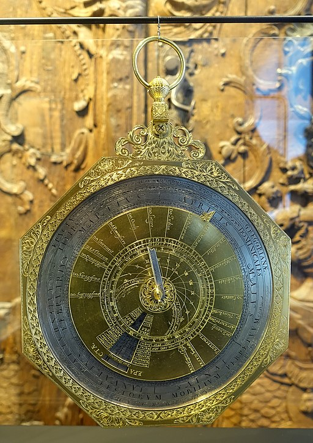

.

Registered on [JuliaHub](https://juliahub.com/ui/Packages/Calendars/yDHMq), read the [Docs](https://docs.juliahub.com/Calendars/yDHMq), get the source from the [repository](https://github.com/PeterLuschny/Calendars.jl) or install with Pkg.add("Calendars").

# Calendars, Conversions of Dates, Change of Calendars  


The package _Calendar_ provides a Julia implementation of six calendars: 

| Acronym | Calendar |
| :---:   |  :---    | 
| CE      | Common   |
| RC      | Julian   |
| EC      | European |
| AM      | Hebrew   |
| AH      | Islamic  |
| ID      | IsoDate  |

The *Common Era* CE dates are computed according to the [proleptic Gregorian](https://en.wikipedia.org/wiki/Proleptic_Gregorian_calendar) rules, *Julian dates* according to the rules of the reformed [Roman calendar](https://en.wikipedia.org/wiki/Julian_calendar) proposed by Julius Caesar. The *European calendar* EC uses the Gregorian calendar for dates on and after CE 1582-10-15 and otherwise the Julian calendar. 

We recommend using the European calendar as it avoids errors and confusions produced by extending the Gregorian calendar rules backward to the dates preceding its official introduction in 1582, as the common calendar CE does.

We do not use the acronym AD ("Anno Domini nostri Jesu Christi"), but use RC instead, which stands for Roman Calendar. [AD](https://en.wikipedia.org/wiki/Anno_Domini) is just a terrible misnomer invented by a 6th-century [monk](https://en.wikipedia.org/wiki/Dionysius_Exiguus), member of the Roman Curia, in a successful attempt to usurp the Roman calendar for the Catholic church. Nothing would have seemed more absurd to Julius Caesar, Pontifex Maximus, chief priest of the Roman state religion than to put his calendar reform at the service of a Jewish sect--which did not even exist in his day. Nowadays the AD terminology is viewed as being exclusive to non-Christian people. However, we keep the start of the epoch and the same numbers for AD years and allow AD for user input as a synonym. 

Dates can be converted from one to another. Note that we follow ISO 8601 for calendar date representations: Year, followed by the month, then the day, YYYY-MM-DD. This order is also used in the signature of the functions. For example, 2022-07-12 represents the 12th of July 2022. 

The primary function provided is:

    ConvertDate(date, calendar, show=false). 

It converts a calendar date to the representation of the date in the calendar 'calendar'.

* The calendar date (CDate) is a tuple (calendar, year, month, day). The parts of the date can be given as a tuple or individually.

* 'calendar' is one of "Common", "Julian", "European", "Hebrew", "Islamic", or "IsoDate". Alternatively you can use the acronyms "CE", "RC", "EC", "AM", "AH", or "ID" explained in the table above.

* If the optional parameter 'show' is set to 'true', both dates are printed. 'show' is 'false' by default.

For example:

```julia
julia> ConvertDate(("Common", 1756, 1, 27), "Hebrew") 
```

or written alternatively

```julia
julia> ConvertDate("CE", 1756, 1, 27, "AM")
```

computes from the Common date (1756, 1, 27) the Hebrew date (5516, 11, 25). If 'show' is 'true' the line

    "CE 1756-01-27 -> AM 5516-11-25" 

is printed.

A second function returns a table of the dates of all supported calendars.

    CalendarDates(date, show=false).

The parameters follow the same conventions as those of ConvertDate. For example:

```julia
julia> CalendarDates("Common", 1756, 1, 27, true) 
```

computes a table, which is a tuple of five dates plus the day number. If 'show' is 'true' the table below will be printed.

```julia
CommonEra   CE 1756-01-27
Julian      RC 1756-01-16
European    EC 1756-01-27
Hebrew      AM 5516-11-25
Islamic     AH 1169-04-24
IsoDate     ID 1756-05-02
DayNumber   RD 641027
``` 

The package provides additional functions; read the documentation for this.

You might start exploring with a Jupyter [notebook](https://github.com/PeterLuschny/Calendars.jl/blob/main/notebook/Calendars.ipynb).

---


### Credits

We use the algorithms by Nachum Dershowitz and Edward M. Reingold, described in 'Calendrical Calculations', Software--Practice & Experience, vol. 20, no. 9 (September, 1990), pp. 899--928.

The picture shows the 'Calendar calculator', owned by Anton Ignaz Joseph Graf von Fugger-Glött, Prince-Provost of Ellwangen, Ostalbkreis, 1765 - Landesmuseum Württemberg, Stuttgart, Germany. The picture is in the public domain.
 
