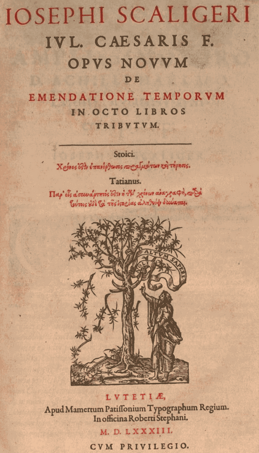

[Calendrical Calculations](https://en.wikipedia.org/wiki/Calendrical_Calculations)

[Reingold calendars](https://reingold.co/calendars.shtml)

[History calendars](https://en.wikipedia.org/wiki/History_of_calendars)

[List of calendars](https://en.wikipedia.org/wiki/List_of_calendars)

[Explanatory supplement](https://web.archive.org/web/20120210184836/http://charon.nmsu.edu/~lhuber/leaphist.html)

[Common Era](https://en.wikipedia.org/wiki/Common_Era)

[Gregorian calendar](https://en.wikipedia.org/wiki/Gregorian_calendar)

[Proleptic Gregorian calendar](https://en.wikipedia.org/wiki/Proleptic_Gregorian_calendar)

[Julian calendar](https://en.wikipedia.org/wiki/Julian_calendar)

[Proleptic Julian calendar](https://en.wikipedia.org/wiki/Proleptic_Julian_calendar)

[On the use of Julian dates](https://www.iers.org/IERS/EN/Science/Recommendations/resolutionB1.html)

[Julian day Calculation](https://en.wikipedia.org/wiki/Julian_day#Calculation)

[Julian date](https://de.wikipedia.org/wiki/Julianisches_Datum)

[Rata Die (DN)](https://en.wikipedia.org/wiki/Rata_Die)

[Modified Julian Date](https://web.archive.org/web/20130214020649/http://tycho.usno.navy.mil/mjd.html)

[Ordinal date](https://en.wikipedia.org/wiki/Ordinal_date)

[Islamic calendar](https://en.wikipedia.org/wiki/Islamic_calendar)

[ISO week date](https://en.wikipedia.org/wiki/ISO_week_date)

[Iso calendar](https://webspace.science.uu.nl/~gent0113/calendar/isocalendar.htm)

[Python datetime src](https://github.com/python/cpython/blob/main/Lib/datetime.py)

[Python datetime api](https://docs.python.org/3/library/datetime.html#date-objects)

[ke!san Online Calculator](https://keisan.casio.com/exec/system/1227779487)

[Calendar Converter for Near East Historians](https://www.muqawwim.com/)

[Calendar Converter](https://www.calendar-converter.com/jewishhebrew/)
